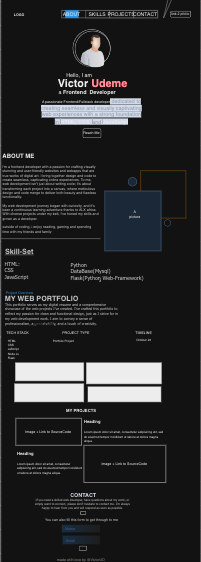

Project Overview:
    > Description:
     ...The personal Portfolio Website...
     It is aimed at creating a dynamic and visually appealing online platform to showcase my skills,
     experiences and projects as a web and mobile developer/designer. It serves as an interactive resume
     and portfolio that highlights my skiils, achivements and work samples.
    
    The primary purpose of these project is to demonstrate my web development and design skills to potential employers, clients, or collaborators.

    The project provide values to users by....
        > Making it easy to access my skilss, experiences and work samples, thereby saving time and effort
        > Keeping users engaged with interactive content.
        > Facilitating contact for job opportunities, collaboration or inquiries.
        > showcasing my abilities and quality of my work to a wider audience.

Features and Functionality:
    > Features And Functionality of the project
       
        1. HomePage:
            ..Users land on the homepage, providing an overview of the entire portfolio.
            ..Interactive elements like animations or scrolling effect to grab user's attention.
       
        2. About Me:
            ..Users read a detailed bio that highlights my background, interests and golas
            .. This section also includes a photo for personal touch
        
        3. Skills:
            ..This page showcases my skills.
            ..Users can click on each skill to learn more or view related project

        4. Project Gallery:
            ..Users can explore a visually appealing gallery of my projects each represented by a thumbnail, title and a brief description.
            ..Users can also access live demos or source code repositories.

        5. Contact Form:
            ..This page allows users to reach out easily
            ..Here, users can fill out a contact form with thier name, email and message.
            ..My email eddress and social media links is also available for direct communication.

        6. Responsive Design:
            The Website adapts seamlessly to different screen sizes and deices ensuring a consistent and user-friendly experience on desktop, tablets and smartphones.

    Technologies Used:
        The technologies used for building this project are
            . HTML (structure)
            . CSS (styling)
            . JavaScript (interactivity)

  
  

RoadMaps and Future Enhancements:
    > I'll add a blog section where i can regularly share tutorials and updates related to web/mobile   development and design.
    
    > I might also create an interactive resume section with downloadable PDF and Linkedin profile integration.
   
    > Would also include a section for client or colleague testimonials to build trust and credibility.
    
    > Finally, Continously monitor and optimize the website's performance for faster loading and better user experience and ensure it functions well across various web browsers and devices.

        

